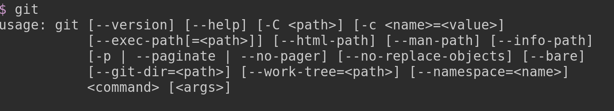
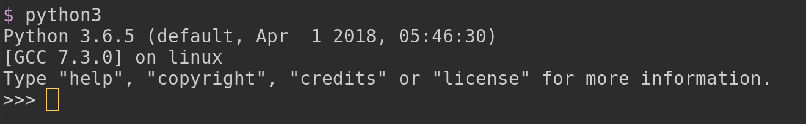
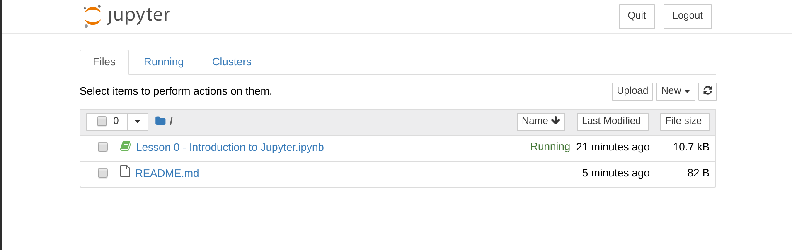

# BUIDL Bootcamp

### Step 1: Git

Git is the primary collaboration software for software development -- like Google Docs for programmers.

To check whether you have it installed go to your terminal, type “git” and hit enter. If you don’t see a bunch of instructions (see pic below), you don’t have git installed and need to install [Git](https://git-scm.com/book/en/v2/Getting-Started-Installing-Git)



### Step 2: Github

[Create a GitHub account](https://github.com/join) if you don’t already have one.

### Step 3: Python

Go to your terminal, type “python3” and hit enter. If you don’t see a “python prompt” (see pic below) then you need to [install Python 3](https://docs.python-guide.org/starting/installation/). Hit control-d or call the python `exit()` function to exit.




### Step 4: Clone the Project with Git, install dependencies, and run it

Execute the following command in your terminal to clone the course and access the introductory “Lesson 0”:

```
git clone https://github.com/superquest/buidlbootcamp.git
cd buidlbootcamp/tinychain
python3 -m virtualenv venv
source venv/bin/activate
python3 -m pip install -r requirements.txt
jupyter notebook
```

This will open up your web browser to a page that looks like the image below. This is [Jupyter Notebook](http://jupyter.org/), which is basically a little website that’s run on only your computer. Click the “Lesson 0 - Introduction to Jupyter.ipynb” link to learn more!



The first lesson can be found in the `tinychain/lesson-one.ipynb`. Open that file in you Jupyter notebook window.
